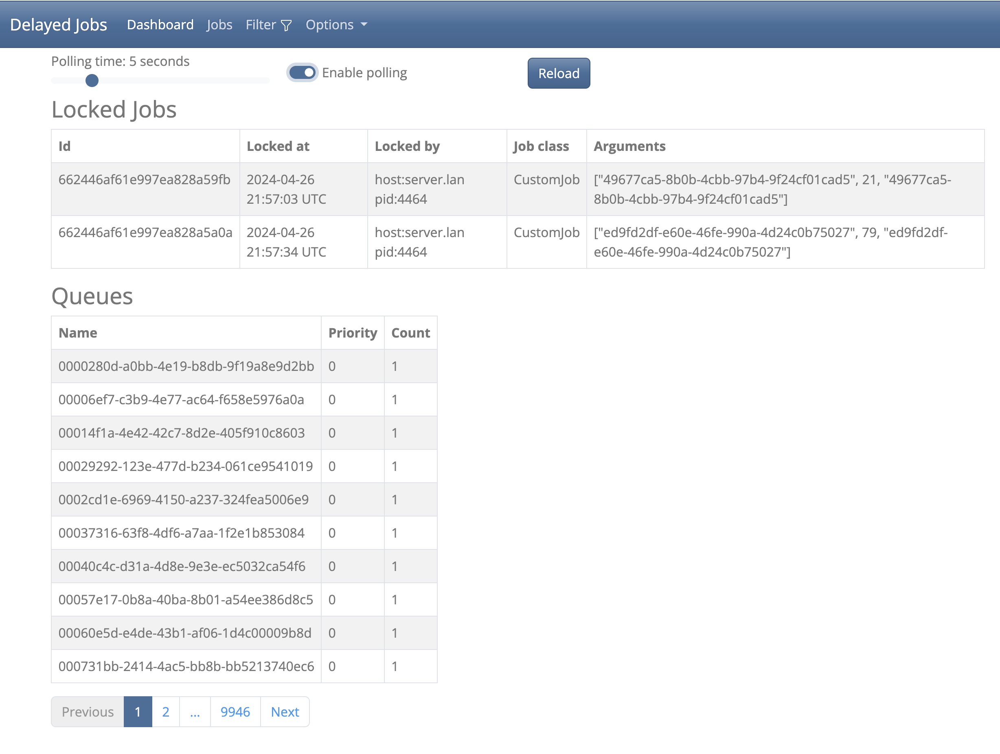
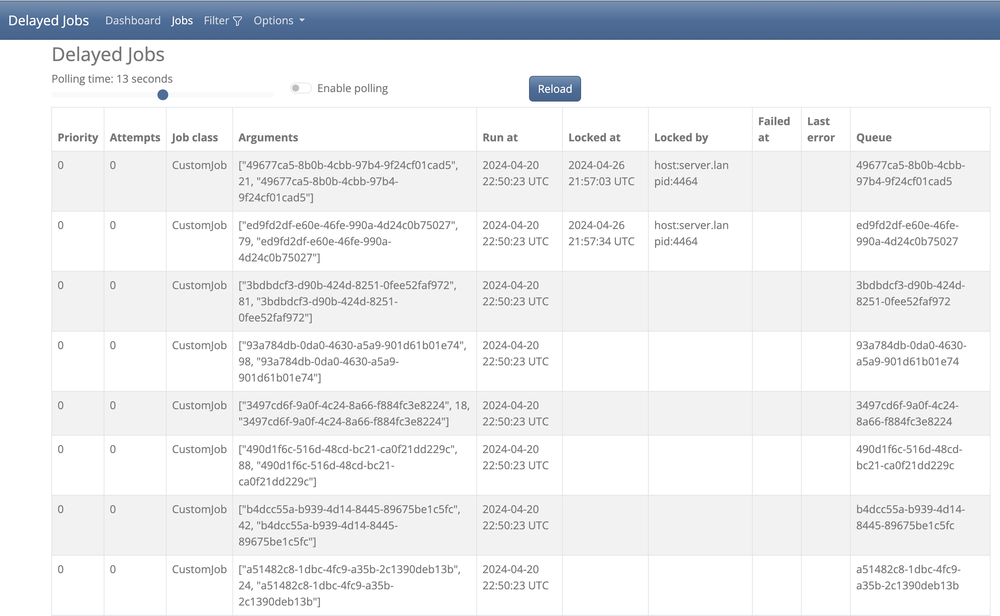

# RushJobMongoid
User interface for Delayed Job Mongoid (https://github.com/collectiveidea/delayed_job_mongoid) in Ruby on Rails 




### Note
 - This app uses cookies to store the selected options.

## Usage
You will need Delayed Job, `delayed_job`, and Delayed Job Mongoid, `delayed_job_mongoid`, installed in a Ruby on Rails application for this gem to work properly.

Navigate to the `/rush_job_mongoid` route in your application to see the Delayed Jobs. Locally this would be `http://localhost:3000/rush_job_mongoid`

### Options

#### Dark Mode

Enables or disables dark mode

#### Editing

Make sure workers are stopped before editing

#### Queues

Queues on the dashboard are eager loaded. If there are lots of queues this can affect performance. Disable queues if this becomes an issue.

## Installation
Add this line to your Ruby on Rails application's Gemfile:

```ruby
gem 'rush_job_mongoid', '~> 1.5'
```

And then execute:
```bash
$ bundle install
```

Add the following to your `config/routes.rb` file:
```ruby
mount RushJobMongoid::Engine => '/rush_job_mongoid'
```

## Contributing
Open an issue or
  1. Fork
  2. Update
  3. Test
      1. `bundle exec rails test:all` and check coverage in `test/coverage/index.html`
      2. `bundle exec rubocop`
      3. `bundle exec brakeman`
  4. Open pull request

## Turbo
This gem uses turbo-rails, https://github.com/hotwired/turbo-rails. For Rails UJS fork from v1.0.2

## License
The gem is available as open source under the terms of the [MIT License](https://opensource.org/licenses/MIT).
